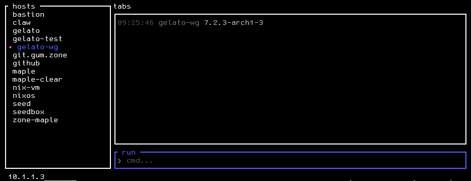

# shork

## [ EXTREMELY WIP ]

a small tool for executing commands on one or more machines using SSH

## status:

- [x] ssh-agent support
- [x] single host cmd exec
- [ ] passphrase support
- [x] ad-hoc group exec



```
note: not vibe coded, claude is for review, debugging, and eval.
this is a personal learning project.
```
